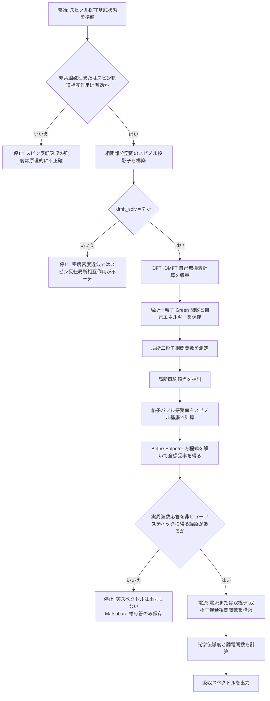
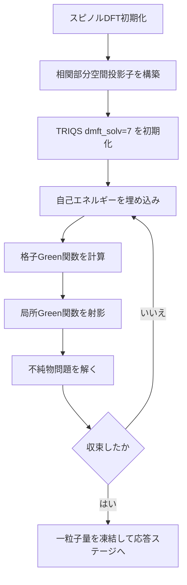

# MnF₂型スピン反転励起を含む吸収スペクトルのための DFT+DMFT 実装詳細設計書

## 0. 最初に結論を書く

この設計書は、**現在の ABINIT リポジトリに実装されている DFT+DMFT を出発点として、MnF₂ のようにスピン反転励起が重要な系に対して吸収スペクトルを計算できるようにするために必要な実装**を、真実ベースで整理したものである。

最初に重要な事実を明示する。

1. `/home/runner/work/abinit/abinit/doc/topics/_DMFT.md` には、ABINIT 内部の連続時間量子モンテカルロソルバーが **density-density 相互作用**を前提とし、さらにハイブリダイゼーション関数が**軌道指標で対角**であることを仮定していることが書かれている。
2. `/home/runner/work/abinit/abinit/doc/tutorial/dmft_triqs.md` と `/home/runner/work/abinit/abinit/src/65_paw/m_paw_dmft.F90` から、TRIQS/CT-HYB を用いる `dmft_solv = 7` では**回転不変な Slater 相互作用**が扱えることが確認できる。
3. `/home/runner/work/abinit/abinit/src/79_seqpar_mpi/m_tddft.F90` には、既存の TDDFT/Casida 経路について **`spin flip is not possible actually`** と明記されている。
4. `/home/runner/work/abinit/abinit/doc/theory/noncollinear.md` から、ABINIT にはスピノル密度行列と非共線磁性の理論基盤がある。

したがって、**現在の実装だけでは「MnF₂ 型のスピン反転が重要な吸収スペクトル」を正しく計算することはできない**。  
必要なのは、単なる一粒子自己エネルギーの追加ではなく、

- スピノル基底
- 回転不変な局所相互作用
- スピン指標を持つ二粒子応答関数
- 実周波数の吸収スペクトルを、解析接続のヒューリスティックに頼らずに得るための経路

を一貫して実装することである。

本設計書は、この前提を隠さずに、必要な新規実装を詳細化する。

---

## 1. 要求仕様の再定義

### 1.1 目的

ABINIT の DFT+DMFT 基盤を拡張し、MnF₂ のような

- 反強磁性絶縁体
- 多軌道局在電子系
- スピン反転励起がスペクトル強度に本質的に関与する系

に対して、**吸収スペクトル**を計算できるようにする。

### 1.2 この設計で「吸収スペクトル」と呼ぶ量

本設計で対象とするのは、外場に対する線形応答として定義される周波数依存の吸収であり、基本量は

\[
\sigma_{\mu\nu}^{R}(\omega)
\]

または

\[
\varepsilon_{\mu\nu}^{R}(\omega)
\]

である。ここで

- \(\mu, \nu \in \{x,y,z\}\) は空間方向
- 上付き \(R\) は遅延関数
- \(\sigma\) は光学伝導度テンソル
- \(\varepsilon\) は誘電関数テンソル

を表す。

等方近似を用いない。MnF₂ のような反強磁性系ではテンソル異方性を捨てると本質を失うためである。

### 1.3 この設計で禁止すること

ユーザー要求に従い、以下を**禁止**する。

1. 最大エントロピー法による解析接続
2. Padé 近似による解析接続
3. 経験的ブロードニングを主手段にして実スペクトルを作ること
4. 「対角成分が小さそうだから捨てる」といった物理的根拠のない切り捨て
5. 「スピン反転は弱いだろう」と仮定してスピンチャンネルを縮約すること

この禁止条件は、実装の複雑さを上げるが、物理の嘘を避けるために必須である。

---

## 2. 物理的に必要な条件

MnF₂ 型の吸収でスピン反転が重要になるなら、少なくとも以下が必要である。

### 2.1 スピノル波動関数

スピンを \(\uparrow, \downarrow\) の固定量子数として分離したままでは、スピン反転光学遷移の強度は一般には記述できない。  
したがって、一電子状態はスピノル

\[
\Psi_{n\mathbf{k}}(\mathbf{r}) =
\begin{pmatrix}
\psi_{n\mathbf{k}\uparrow}(\mathbf{r}) \\
\psi_{n\mathbf{k}\downarrow}(\mathbf{r})
\end{pmatrix}
\]

として保持する。

### 2.2 非共線磁性またはスピン軌道相互作用

電気双極子演算子

\[
\hat{\mathbf{d}} = - e \sum_{i} \hat{\mathbf{r}}_i
\]

は、非相対論的極限ではスピンに直接作用しない。よって、**純粋な電気双極子遷移だけではスピン反転強度は原理的には出ない**。

実際に吸収強度にスピン反転成分が現れるには、少なくとも次のいずれかが必要である。

1. スピン軌道相互作用によるスピン混合
2. 非共線磁性によるスピノル混合
3. 磁気双極子または高次多極子遷移の明示的取り込み

したがって、**基底状態計算の前提条件**として、少なくとも

- 非共線磁性
- もしくはスピン軌道相互作用

を有効化した DFT+DMFT を要求する。

### 2.3 回転不変局所相互作用

スピン反転励起を扱うのに、密度密度近似

\[
\hat{H}_{\text{int}}^{\text{dens-dens}}
=
\sum_{m m' \sigma \sigma'}
U_{m m' \sigma \sigma'}
\hat{n}_{m\sigma}\hat{n}_{m'\sigma'}
\]

だけでは不十分である。  
必要なのは、スピン反転項と対生成消滅項を含む一般の四演算子相互作用

\[
\hat{H}_{\text{int}}
=
\frac{1}{2}
\sum_{m_1 m_2 m_3 m_4}
\sum_{\sigma_1 \sigma_2}
U_{m_1 m_2 m_3 m_4}
\,
\hat{c}_{m_1\sigma_1}^{\dagger}
\hat{c}_{m_2\sigma_2}^{\dagger}
\hat{c}_{m_4\sigma_2}
\hat{c}_{m_3\sigma_1}
\]

である。

従って、基底状態の不純物ソルバーとしては **`dmft_solv = 7` の TRIQS/CT-HYB 経路を最低条件**とする。

---

## 3. 現状実装の到達点と不足点

### 3.1 現在すでにあるもの

1. **DFT+DMFT の自己無撞着基盤**
2. **TRIQS/CT-HYB のインターフェース**
3. **回転不変相互作用を使う `dmft_solv = 7`**
4. **非共線磁性の理論基盤**
5. **オフ対角ハイブリダイゼーションを扱うコード経路**

### 3.2 現在ないもの

1. DMFT の**二粒子局所頂点**を測定し、ABINIT 側に返す正式経路
2. スピン指標付きの**格子 Bethe-Salpeter 方程式**
3. DMFT 自己エネルギーと局所頂点を使う**吸収スペクトル専用ドライバ**
4. **非ヒューリスティックな実周波数応答**を出す公式経路
5. TDDFT/Casida を越えて、スピン反転光学応答を扱う統一実装

### 3.3 真実ベースの判定

現状の ABINIT は

- DFT+DMFT 基底状態
- ある程度のスピノル記述
- TRIQS 連携

までは持つが、**スピン反転を含む吸収スペクトルの完成系は未実装**である。

したがって本件は、既存機能の隠しスイッチを探す問題ではなく、**新しい応答理論モジュールの実装設計**の問題である。

---

## 4. 実装全体像

## 4.1 全体フローチャート



### 4.2 実装フェーズ

#### フェーズ A

スピノル DFT+DMFT 基底状態を、回転不変相互作用で安定に回す。

#### フェーズ B

局所二粒子相関関数

\[
\chi_{\text{loc}}
\]

を測定し、既約頂点

\[
\Gamma_{\text{loc}}
\]

を作る。

#### フェーズ C

格子 Bethe-Salpeter 方程式を実装し、吸収に必要な応答関数を得る。

#### フェーズ D

解析接続を使わず、実周波数の吸収スペクトルを出力する。

このフェーズ D が最難関であり、ここを曖昧にすると要件違反になる。

---

## 5. 数理定式化

以下では、実装に必要な式を省略せずに定義する。

### 5.1 スピノル Kohn-Sham ハミルトニアン

スピノル基底での Kohn-Sham ハミルトニアンを

\[
H_{a\sigma, b\sigma'}^{\text{KS}}(\mathbf{k})
\]

とする。ここで

- \(a, b\) は局所基底または PAW 補助基底の軌道番号
- \(\sigma, \sigma' \in \{\uparrow, \downarrow\}\) はスピン指標
- \(\mathbf{k}\) はブリルアンゾーン波数

である。

非直交基底を許すため、重なり行列

\[
S_{a\sigma, b\sigma'}(\mathbf{k})
\]

も保持する。

### 5.2 相関部分空間へのスピノル投影

相関部分空間の軌道を \(\alpha, \beta, \gamma, \delta\) で表す。  
投影子は

\[
P_{\alpha, a\sigma}(\mathbf{k})
=
\langle \phi_{\alpha} | a\mathbf{k}\sigma \rangle
\]

で定義する。

このとき、相関部分空間の Kohn-Sham ハミルトニアンは

\[
H_{\alpha\beta}^{\text{corr}}(\mathbf{k})
=
\sum_{a\sigma}
\sum_{b\sigma'}
P_{\alpha, a\sigma}(\mathbf{k})
\,
H_{a\sigma, b\sigma'}^{\text{KS}}(\mathbf{k})
\,
P_{ \beta, b\sigma'}^{*}(\mathbf{k})
\]

で与える。

スピン混合を禁止してはいけないため、\(\alpha\) 自体が

\[
\alpha \equiv (m,\sigma)
\]

を含む複合添字として実装される必要がある。

### 5.3 DFT+DMFT 格子 Green 関数

Matsubara 周波数

\[
i\omega_n = i(2n+1)\pi/\beta
\]

における格子 Green 関数を

\[
G_{a\sigma,b\sigma'}(\mathbf{k}, i\omega_n)
\]

とする。

その逆行列は

\[
\left[
G(\mathbf{k}, i\omega_n)
\right]^{-1}_{a\sigma,b\sigma'}
=
\left(i\omega_n + \mu\right) S_{a\sigma,b\sigma'}(\mathbf{k})
- H_{a\sigma,b\sigma'}^{\text{KS}}(\mathbf{k})
- \Sigma_{a\sigma,b\sigma'}^{\text{emb}}(\mathbf{k}, i\omega_n)
\]

である。

埋め込み自己エネルギーは

\[
\Sigma_{a\sigma,b\sigma'}^{\text{emb}}(\mathbf{k}, i\omega_n)
=
\sum_{\alpha}
\sum_{\beta}
P_{\alpha, a\sigma}^{*}(\mathbf{k})
\left[
\Sigma_{\alpha\beta}^{\text{imp}}(i\omega_n)
- V_{\alpha\beta}^{\text{DC}}
\right]
P_{\beta, b\sigma'}(\mathbf{k})
\]

で定義する。

ここで

- \(\Sigma^{\text{imp}}\) は不純物自己エネルギー
- \(V^{\text{DC}}\) は double counting 補正

である。

### 5.4 局所 Green 関数

\[
G_{\alpha\beta}^{\text{loc}}(i\omega_n)
=
\frac{1}{N_{\mathbf{k}}}
\sum_{\mathbf{k}}
\sum_{a\sigma}
\sum_{b\sigma'}
P_{\alpha, a\sigma}(\mathbf{k})
\,
G_{a\sigma,b\sigma'}(\mathbf{k}, i\omega_n)
\,
P_{\beta, b\sigma'}^{*}(\mathbf{k})
\]

を局所 Green 関数とする。

### 5.5 不純物作用

完全なスピン反転と軌道交換を含む不純物作用は

\[
\begin{aligned}
S_{\text{imp}}
=\,
&-\sum_{\alpha\beta}
\int_{0}^{\beta} d\tau
\int_{0}^{\beta} d\tau'
\,
c_{\alpha}^{\dagger}(\tau)
\,
\mathcal{G}_{0,\alpha\beta}^{-1}(\tau-\tau')
\,
c_{\beta}(\tau') \\
&+
\frac{1}{2}
\sum_{\alpha\beta\gamma\delta}
\int_{0}^{\beta} d\tau
\,
U_{\alpha\beta\gamma\delta}
\,
c_{\alpha}^{\dagger}(\tau)
c_{\beta}^{\dagger}(\tau)
c_{\delta}(\tau)
c_{\gamma}(\tau)
\end{aligned}
\]

で与える。

ここで \(\alpha,\beta,\gamma,\delta\) は軌道とスピンを含む複合添字である。

### 5.6 不純物 Dyson 方程式

\[
\left[
G^{\text{imp}}(i\omega_n)
\right]^{-1}
=
\mathcal{G}_{0}^{-1}(i\omega_n)
- \Sigma^{\text{imp}}(i\omega_n)
\]

を満たす。

DMFT 自己無撞着条件は

\[
G^{\text{imp}}_{\alpha\beta}(i\omega_n)
=
G^{\text{loc}}_{\alpha\beta}(i\omega_n)
\]

である。

### 5.7 局所二粒子相関関数

吸収スペクトルでは一粒子量だけでは足りず、局所二粒子相関関数が必要である。

粒子正孔チャネルの一般形を

\[
\chi_{\alpha\beta\gamma\delta}^{\text{imp}}
(i\omega_n, i\omega_{n'}; i\Omega_m)
\]

とし、

\[
\begin{aligned}
\chi_{\alpha\beta\gamma\delta}^{\text{imp}}
(i\omega_n, i\omega_{n'}; i\Omega_m)
=\,
&\int_{0}^{\beta} d\tau_1
\int_{0}^{\beta} d\tau_2
\int_{0}^{\beta} d\tau_3
\int_{0}^{\beta} d\tau_4 \\
&\times
e^{i\omega_n(\tau_1-\tau_2)}
e^{i\omega_{n'}(\tau_3-\tau_4)}
e^{i\Omega_m(\tau_2-\tau_3)} \\
&\times
\left\langle
T_{\tau}
c_{\alpha}^{\dagger}(\tau_1)
c_{\beta}(\tau_2)
c_{\gamma}^{\dagger}(\tau_3)
c_{\delta}(\tau_4)
\right\rangle_{\text{conn}}
\end{aligned}
\]

と定義する。

ここで \(\langle \cdots \rangle_{\text{conn}}\) は連結部分だけを取ることを意味する。

### 5.8 スピン反転チャネル

MnF₂ 型で重要なのは、少なくとも

\[
S^{+}_{m m'} = c_{m\uparrow}^{\dagger} c_{m'\downarrow},
\qquad
S^{-}_{m m'} = c_{m\downarrow}^{\dagger} c_{m'\uparrow}
\]

で張られるチャネルである。

対応する感受率は

\[
\chi^{+-}_{m_1 m_2 m_3 m_4}(i\Omega_m)
=
\int_{0}^{\beta} d\tau \,
e^{i\Omega_m \tau}
\left\langle
T_{\tau}
S^{+}_{m_1 m_2}(\tau)
S^{-}_{m_3 m_4}(0)
\right\rangle
\]

で与える。

このチャネルを潰すと、設計目標を失う。

### 5.9 裸の局所二粒子関数

局所 bubble は

\[
\chi_{0,\alpha\beta\gamma\delta}^{\text{imp}}
(i\omega_n, i\omega_{n'}; i\Omega_m)
=
-\beta
\,
\delta_{n n'}
\,
G_{\beta\gamma}^{\text{imp}}(i\omega_n)
\,
G_{\delta\alpha}^{\text{imp}}(i\omega_n + i\Omega_m)
\]

で与える。

### 5.10 局所既約頂点

粒子正孔チャネルの既約頂点を

\[
\Gamma^{\text{imp}}
\]

とすると、行列表現で

\[
\left[\chi^{\text{imp}}(i\Omega_m)\right]^{-1}
=
\left[\chi_{0}^{\text{imp}}(i\Omega_m)\right]^{-1}
- \Gamma^{\text{imp}}(i\Omega_m)
\]

で定義される。すなわち

\[
\Gamma^{\text{imp}}(i\Omega_m)
=
\left[\chi_{0}^{\text{imp}}(i\Omega_m)\right]^{-1}
- \left[\chi^{\text{imp}}(i\Omega_m)\right]^{-1}
\]

である。

ここで逆行列は、複合添字

\[
I \equiv (\alpha,\beta,n), \qquad
J \equiv (\gamma,\delta,n')
\]

に関する行列逆行列である。

### 5.11 格子 bubble

格子上の粒子正孔 bubble は

\[
\chi^{0}_{\alpha\beta\gamma\delta}
(\mathbf{q}, i\omega_n, i\Omega_m)
=
-\frac{1}{N_{\mathbf{k}}}
\sum_{\mathbf{k}}
G_{\beta\gamma}(\mathbf{k}, i\omega_n)
G_{\delta\alpha}(\mathbf{k}+\mathbf{q}, i\omega_n + i\Omega_m)
\]

で定義する。

光吸収では \(\mathbf{q}\rightarrow 0\) 極限を取る。

### 5.12 格子 Bethe-Salpeter 方程式

格子全感受率は

\[
\chi(\mathbf{q}, i\Omega_m)
=
\chi^{0}(\mathbf{q}, i\Omega_m)
+
\chi^{0}(\mathbf{q}, i\Omega_m)
\Gamma^{\text{imp}}(i\Omega_m)
\chi(\mathbf{q}, i\Omega_m)
\]

で決まり、形式的には

\[
\chi(\mathbf{q}, i\Omega_m)
=
\left[
\left(\chi^{0}(\mathbf{q}, i\Omega_m)\right)^{-1}
- \Gamma^{\text{imp}}(i\Omega_m)
\right]^{-1}
\]

となる。

### 5.13 電流頂点

光学応答に必要な電流演算子は

\[
\hat{j}_{\mu}
=
-e
\frac{\partial \hat{H}}{\partial k_{\mu}}
\]

で与える。

基底表示では

\[
j_{\mu; a\sigma,b\sigma'}(\mathbf{k})
=
-e
\frac{\partial H_{a\sigma,b\sigma'}^{\text{KS}}(\mathbf{k})}{\partial k_{\mu}}
\]

とする。

スピノル基底を採用する以上、

\[
j_{\mu; a\uparrow,b\downarrow}(\mathbf{k})
\]

のようなスピン混合成分を保持する。

### 5.14 電流-電流相関関数

Matsubara 表示の電流-電流相関関数は

\[
\Pi_{\mu\nu}(i\Omega_m)
=
\int_{0}^{\beta} d\tau \,
e^{i\Omega_m\tau}
\langle
T_{\tau}
\hat{j}_{\mu}(\tau)
\hat{j}_{\nu}(0)
\rangle
\]

である。

頂点補正込みでは

\[
\Pi_{\mu\nu}(i\Omega_m)
=
\Pi_{\mu\nu}^{\text{bubble}}(i\Omega_m)
+
\Pi_{\mu\nu}^{\text{vertex}}(i\Omega_m)
\]

となる。

### 5.15 光学伝導度と誘電関数

実周波数上の遅延相関関数 \(\Pi_{\mu\nu}^{R}(\omega)\) が得られれば、

\[
\sigma_{\mu\nu}(\omega)
=
\frac{1}{i(\omega + i 0^{+})}
\left[
\Pi_{\mu\nu}^{R}(\omega)
- \Pi_{\mu\nu}^{R}(0)
\right]
\]

で光学伝導度を計算できる。

誘電関数は単位系に依存する係数を明示すれば

\[
\varepsilon_{\mu\nu}(\omega)
=
\delta_{\mu\nu}
+
\frac{4\pi i}{\omega}
\sigma_{\mu\nu}(\omega)
\]

で与えられる。

吸収係数は複素屈折率

\[
\tilde{n}_{\mu}(\omega)=n_{\mu}(\omega)+i\kappa_{\mu}(\omega)
\]

を用いて

\[
\alpha_{\mu}(\omega)
=
\frac{2\omega}{c}
\kappa_{\mu}(\omega)
\]

とする。

---

## 6. 実周波数応答についての厳密な設計判断

### 6.1 ここが最大の論点

CT-HYB は本質的に虚時間または Matsubara 軸のソルバーである。  
したがって、

\[
\Pi_{\mu\nu}(i\Omega_m)
\]

から

\[
\Pi_{\mu\nu}^{R}(\omega)
\]

を得るには通常は解析接続が必要になる。

しかし本件では、解析接続のヒューリスティックを禁止している。  
よって、**最大エントロピー法や Padé 近似で吸収スペクトルを出す設計は採用不可**である。

### 6.2 したがって必要な実装方針

本件で許される設計は、次のどちらかだけである。

#### 方針 A: 実周波数の不純物応答を直接計算する

すなわち、

\[
G^{R,\text{imp}}(\omega), \qquad
\chi^{R,\text{imp}}(\omega), \qquad
\Gamma^{R,\text{imp}}(\omega,\omega';\Omega)
\]

を直接与える不純物ソルバーまたは決定論的補助ソルバーを実装する。

#### 方針 B: 実軸を直接扱う線形応答の別定式化を導入する

たとえば Keldysh 形式または Lehmann 表示を明示的に用い、最初から

\[
\Pi_{\mu\nu}^{R}(\omega)
\]

を組み立てる。

### 6.3 本設計の推奨

**推奨は方針 A** である。  
理由は、ABINIT にはすでに虚軸 DMFT の自己無撞着基盤があるため、そこに「実周波数の局所応答を返す補助不純物ソルバー」を追加する方が、コード分離と検証の観点で明確だからである。

ただしここで重要なのは、**現在のリポジトリにはその補助ソルバーが存在しない**という事実である。  
よって、最終機能の完成には新規ソルバー開発が必須である。

### 6.4 段階的リリースの条件

#### リリース 1

Matsubara 軸の

\[
\chi^{+-}(i\Omega_m)
\]

までを出力する。  
これは厳密であり、ヒューリスティックではない。

#### リリース 2

実周波数の

\[
\alpha(\omega)
\]

を出力する。  
この段階では、実周波数不純物応答の正式実装が完了していることを必須条件とする。

つまり、**リリース 1 の時点では「吸収スペクトル完成」とは呼ばない**。

---

## 7. 具体的なコード設計

### 7.1 変更対象モジュール

以下を新設または拡張する。

#### 既存モジュールの拡張

1. `/home/runner/work/abinit/abinit/src/65_paw/m_paw_dmft.F90`  
   DFT+DMFT 応答計算の初期化フラグとログ出力を追加する。

2. `/home/runner/work/abinit/abinit/src/57_iovars/m_invars1.F90`  
   `/home/runner/work/abinit/abinit/src/57_iovars/m_invars2.F90`  
   応答計算用の入力変数を追加する。

3. `/home/runner/work/abinit/abinit/src/57_iovars/m_chkinp.F90`  
   入力整合性検査を追加する。

4. `/home/runner/work/abinit/abinit/src/95_drive/m_respfn_driver.F90`  
   応答ドライバの分岐に DFT+DMFT 吸収計算を追加する。

5. `/home/runner/work/abinit/abinit/src/67_triqs_ext/triqs_cthyb_qmc.cpp`  
   二粒子測定および頂点出力の連携口を追加する。

#### 新規モジュール

1. `/home/runner/work/abinit/abinit/src/68_dmft/m_dmft_spinor_proj.F90`  
   スピノル投影子と相関部分空間の管理

2. `/home/runner/work/abinit/abinit/src/68_dmft/m_dmft_two_particle.F90`  
   局所二粒子相関関数の保持

3. `/home/runner/work/abinit/abinit/src/68_dmft/m_dmft_vertex.F90`  
   局所既約頂点の構築

4. `/home/runner/work/abinit/abinit/src/68_dmft/m_dmft_lattice_bse.F90`  
   格子 bubble と Bethe-Salpeter 方程式の解法

5. `/home/runner/work/abinit/abinit/src/68_dmft/m_dmft_optic_kernel.F90`  
   電流頂点と光学カーネル

6. `/home/runner/work/abinit/abinit/src/68_dmft/m_dmft_realaxis_response.F90`  
   実周波数応答の正式 backend

7. `/home/runner/work/abinit/abinit/src/95_drive/m_dmft_absorption_driver.F90`  
   ユーザーが直接叩く高水準ドライバ

### 7.2 提案入力変数

以下を新規追加する。

| 変数名 | 型 | 意味 |
| --- | --- | --- |
| `dmft_resp_mode` | integer | `0`: 無効, `1`: Matsubara 二粒子応答, `2`: 実周波数吸収 |
| `dmft_resp_spinflip` | integer | `0`: 無効, `1`: \(S^{+}S^{-}\) チャネルを計算 |
| `dmft_resp_current_vertex` | integer | `0`: bubble のみ, `1`: 頂点補正込み |
| `dmft_resp_realaxis_backend` | integer | `0`: 未設定, `1`: 正式 real-axis impurity backend |
| `dmft_resp_nboson` | integer | ボソン Matsubara 周波数数 |
| `dmft_resp_niw_vertex` | integer | 頂点測定に使うフェルミ Matsubara 周波数数 |
| `dmft_resp_soc_required` | integer | `1` のとき SOC または非共線磁性がなければ停止 |

### 7.3 入力整合性チェック

`m_chkinp.F90` で以下を必須にする。

1. `dmft_resp_mode > 0` のとき `usedmft` が有効
2. `dmft_resp_spinflip = 1` のとき `dmft_solv = 7`
3. `dmft_resp_spinflip = 1` のとき非共線磁性またはスピン軌道相互作用が有効
4. `dmft_resp_mode = 2` のとき `dmft_resp_realaxis_backend = 1`
5. `dmft_resp_current_vertex = 1` のとき局所二粒子測定が有効

これらを満たさない場合は**警告ではなく停止**にする。  
黙って近似に落とすと要件違反だからである。

---

## 8. データ構造設計

### 8.1 一粒子 Green 関数

```text
Gk(iw, ik, a_sigma, b_sigma)
```

添字の実装順はキャッシュ効率のため、

1. 複素周波数
2. k 点
3. 右インデックス
4. 左インデックス

の順を推奨する。

### 8.2 局所二粒子関数

```text
chi_imp(iOm, iw_in, iw_out, alpha, beta, gamma, delta)
```

ただし保存コストが極大なので、実装では複合添字

\[
I=(\alpha,\beta, n), \qquad J=(\gamma,\delta, n')
\]

に圧縮し、

```text
chi_imp(iOm, I, J)
```

として保存する。

### 8.3 頂点

\[
\Gamma(i\Omega_m)
\]

は巨大行列になるので、全保持ではなく

- ブロック分解
- スピン対称性
- 軌道対称性

を**厳密に証明できる場合だけ**用いる。

「小さいから落とす」は禁止する。

### 8.4 実周波数出力

```text
omega(ir)
sigma_mu_nu(ir, mu, nu)
epsilon_mu_nu(ir, mu, nu)
alpha_mu(ir, mu)
```

を NetCDF または既存 ABINIT 出力に整合する形式で保存する。

---

## 9. アルゴリズム設計

## 9.1 基底状態ステージ



## 9.2 二粒子測定ステージ

```mermaid
flowchart TD
    B1[収束した不純物浴を固定] --> B2[二粒子測定付きでTRIQS/CT-HYBを再実行]
    B2 --> B3[chi_imp(iw,iwp,iOm) を取得]
    B3 --> B4[connected part を構成]
    B4 --> B5[chi0_imp を一粒子Green関数から構築]
    B5 --> B6[Gamma_imp = chi0_imp^-1 - chi_imp^-1]
    B6 --> B7[局所頂点を保存]
```

## 9.3 格子応答ステージ

```mermaid
flowchart TD
    C1[k点ごとのスピノルGreen関数を生成] --> C2[電流頂点 j_mu(k) を構築]
    C2 --> C3[chi0_latt(q→0,iw,iOm) を構築]
    C3 --> C4[Gamma_imp を埋め込む]
    C4 --> C5[Bethe-Salpeter 方程式を解く]
    C5 --> C6[Pi_mu_nu を構成]
    C6 --> C7{real-axis backend あり?}
    C7 -- いいえ --> C8[Matsubara応答のみ出力]
    C7 -- はい --> C9[Pi_mu_nu^R(omega) を構成]
    C9 --> C10[sigma, epsilon, alpha を出力]
```

---

## 10. 実装上の最重要ポイント

### 10.1 既存 TDDFT 実装を流用しない

既存 `m_tddft.F90` はスピン反転ができないと明示している。  
従って、

- 既存 Casida 行列へ DMFT 補正を足す
- 既存 TDDFT のスピンブロックを少し拡張する

という方針は、最小改造に見えて実際には危険である。

本件は、**TDDFT 拡張ではなく DMFT 応答の新規ドライバ**として切り出すべきである。

### 10.2 density-density solver を禁止する

ABINIT 内部 CT-QMC や `dmft_solv = 6` は、本件の主対象には不十分である。  
スピン反転励起を正面から扱う以上、`dmft_solv = 7` 以外を許すべきではない。

### 10.3 オフ対角ハイブリダイゼーションを残す

MnF₂ 型の結晶場とスピン混合では、軌道・スピン空間のオフ対角成分が効く可能性が高い。  
よって

\[
\Delta_{\alpha\beta}(i\omega_n)
\]

の非対角要素を基本的には保持する。

### 10.4 実スペクトルを無理に出さない

real-axis backend 未実装の段階では、

- Matsubara 軸感受率
- 局所頂点
- bubble と vertex correction の分離出力

までに留める。  
これを「未完成」と明記して出すのは誠実であり、無理に吸収スペクトルをでっち上げるより正しい。

---

## 11. 検証計画

### 11.1 単体検証

1. `dmft_resp_spinflip = 1` かつ `dmft_solv != 7` で停止すること
2. SOC なし・非共線磁性なしで停止すること
3. \(\chi^{\text{imp}}\) と \(\chi_{0}^{\text{imp}}\) の次元が一致すること
4. \(\Gamma^{\text{imp}}\) の逆変換で \(\chi^{\text{imp}}\) が再構成できること

### 11.2 物理検証

1. **ゼロ相互作用極限**

\[
U_{\alpha\beta\gamma\delta} \to 0
\]

で頂点補正が消え、

\[
\chi \to \chi^{0}
\]

となること。

2. **スピン回転対称極限**

SOC なし、非共線性なし、回転対称な模型で

\[
\chi^{+-}, \chi^{-+}, \chi^{zz}
\]

の間に成り立つ規格化関係が、採用したスピン演算子
\(
S^{+}, S^{-}, S^{z}
\)
の定義と厳密に整合すること。  
たとえば
\(
S^{z} = \frac{1}{2}(n_{\uparrow}-n_{\downarrow})
\)
という標準規格化を採用するなら、既知のスピン回転対称関係と一致することを確認する。

3. **既知模型との比較**

二軌道 Hubbard 模型や原子極限で、厳密対角化と同じ極位置が出ること。

4. **MnF₂ 型テスト**

スピン反転チャネルを切ると消えるピークが、スピン反転チャネルを入れると立つこと。

### 11.3 数値検証

1. \(N_{\mathbf{k}}\) 収束
2. \(\omega_n\) 打ち切り収束
3. \(\Omega_m\) 打ち切り収束
4. 相関部分空間の選択に対する収束
5. CT-HYB 統計誤差が頂点に与える影響評価

---

## 12. 性能とメモリ見積もり

局所頂点の主メモリは概ね

\[
\mathcal{O}
\left(
N_{\Omega}
\times
\left(N_{\text{orb}}^{2} N_{\sigma}^{2} N_{\omega}\right)^{2}
\right)
\]

で増える。

ここで

- \(N_{\Omega}\) はボソン周波数数
- \(N_{\text{orb}}\) は相関軌道数
- \(N_{\sigma}=2\)
- \(N_{\omega}\) はフェルミ Matsubara 周波数数

である。

Mn \(3d\) 全軌道を扱うなら \(N_{\text{orb}}=5\) なので、フルテンソル保存は極めて重い。

したがって必要なのは

1. 複合添字化
2. ブロック疎行列化
3. \(\mathbf{q}=0\) 専用の最適化
4. 分散メモリ並列化

である。

ただし、**物理を壊す切り捨ては使わない**。

---

## 13. リスク評価

### 13.1 最大の技術リスク

実周波数不純物応答 backend の不在である。

これは「後でなんとかする」では済まない。  
これがない限り、厳密な意味での吸収スペクトルは完成しない。

### 13.2 次のリスク

局所二粒子頂点の統計誤差である。  
CT-HYB の二粒子量は一粒子量よりはるかにノイジーであるため、

\[
\Gamma = \chi_{0}^{-1} - \chi^{-1}
\]

の逆行列操作が数値的に不安定になりやすい。

この問題に対しても、ノイズを「見た目で平滑化する」ことは禁止する。  
必要ならば

- 測定回数の増加
- 高精度行列演算
- 対称性投影

のような正当な手段だけを用いる。

---

## 14. 実装完了条件

以下をすべて満たしたときに完了と判定する。

1. スピノル DFT+DMFT 基底状態が `dmft_solv = 7` で収束する
2. 局所二粒子相関関数と既約頂点が保存できる
3. \(\mathbf{q}\rightarrow 0\) の格子 Bethe-Salpeter 方程式が解ける
4. スピン反転チャネルを有効にしたときと無効にしたときでスペクトル差が追跡できる
5. real-axis backend が実装され、解析接続なしで

\[
\sigma_{\mu\nu}(\omega),\quad
\varepsilon_{\mu\nu}(\omega),\quad
\alpha_{\mu}(\omega)
\]

が出力できる
6. MnF₂ 型テストケースで、スピン反転に起因する吸収強度の差が再現される

---

## 15. 実装優先順位

1. **必須**: `dmft_solv = 7` を前提とするスピノル DFT+DMFT の安定化
2. **必須**: TRIQS interface に二粒子測定を追加
3. **必須**: 局所既約頂点の構築
4. **必須**: 格子 Bethe-Salpeter 方程式
5. **必須**: 実周波数 backend
6. **その後**: 出力整形、可視化支援、チュートリアル

この順序を崩すべきではない。  
とくに 5 を飛ばして「とりあえず吸収スペクトル」を出すのは本件の要求に反する。

---

## 16. 要点の一文まとめ

**MnF₂ 型のスピン反転が重要な吸収スペクトルを、ABINIT の DFT+DMFT を使って非ヒューリスティックに実装するには、`dmft_solv = 7` を前提に、スピノル相関部分空間、局所二粒子頂点、格子 Bethe-Salpeter 方程式、そして実周波数応答 backend を新規に実装する必要があり、既存 TDDFT/Casida 経路の流用では到達できない。**

---

## 17. 根拠として参照したリポジトリ内ファイル

- `/home/runner/work/abinit/abinit/doc/topics/_DMFT.md`
- `/home/runner/work/abinit/abinit/doc/topics/_DmftTriqsCthyb.md`
- `/home/runner/work/abinit/abinit/doc/tutorial/dmft.md`
- `/home/runner/work/abinit/abinit/doc/tutorial/dmft_triqs.md`
- `/home/runner/work/abinit/abinit/doc/theory/noncollinear.md`
- `/home/runner/work/abinit/abinit/src/65_paw/m_paw_dmft.F90`
- `/home/runner/work/abinit/abinit/src/79_seqpar_mpi/m_tddft.F90`
- `/home/runner/work/abinit/abinit/src/62_ctqmc/m_Ctqmcoffdiag.F90`
- `/home/runner/work/abinit/abinit/src/62_ctqmc/m_GreenHyboffdiag.F90`
